# PRNTD Product Vision

*April 2026*

---

## 1. Current State

### User Journey Today

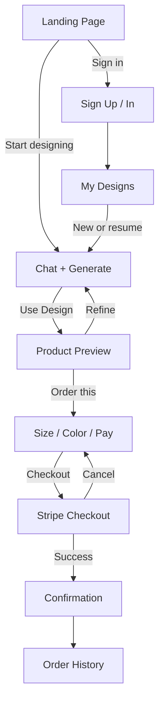

### Design Record Lifecycle

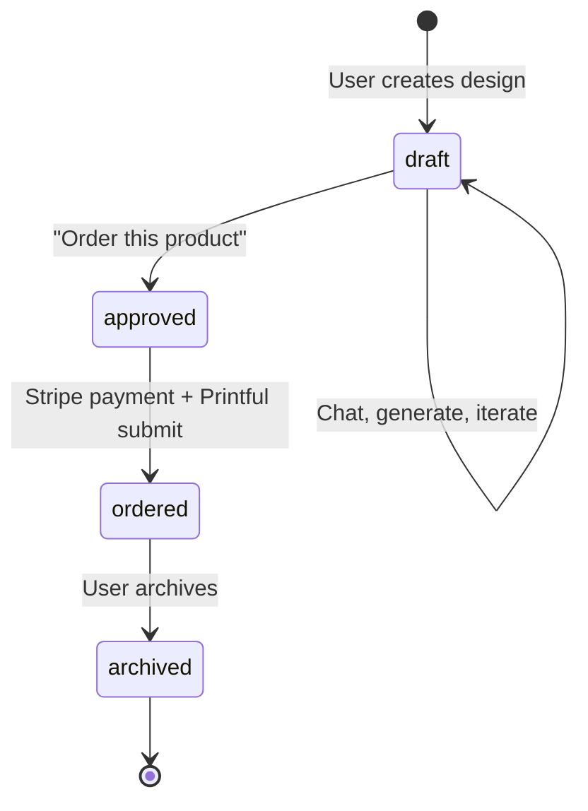

### Order Record Lifecycle

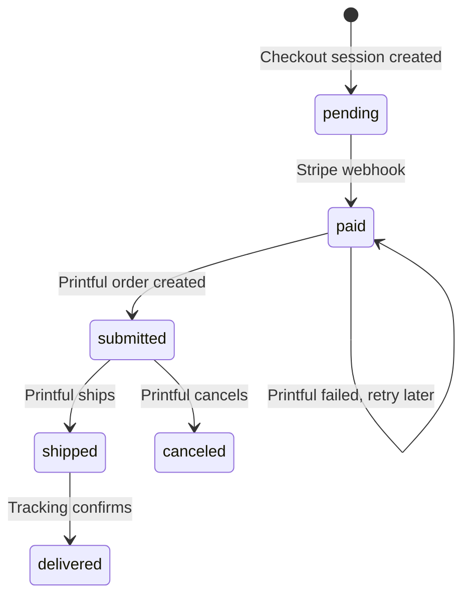

### Current Design Flow (Detail)

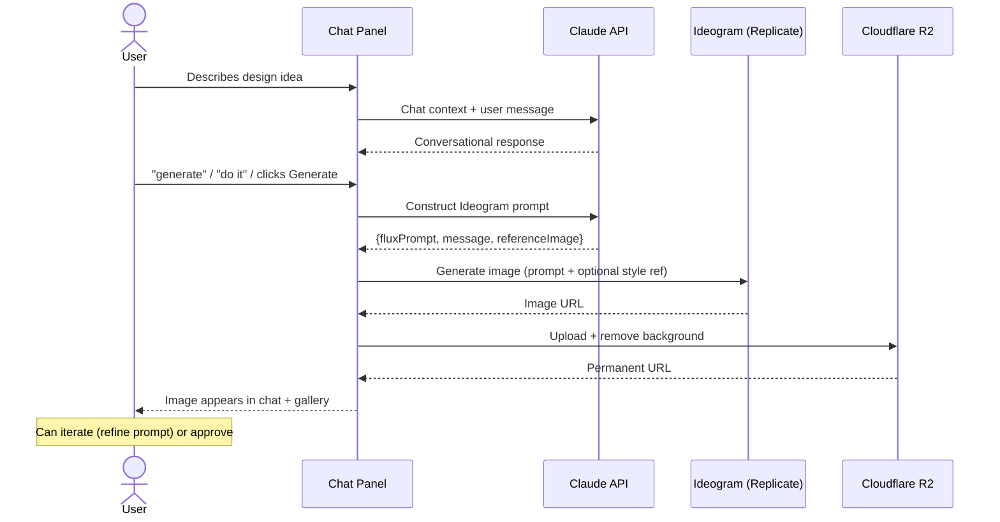

### What's Missing Today

- **Iteration is clumsy**: refining a design means describing changes in chat and re-generating the entire image. No way to say "keep everything but change the text" with precision.
- **Text is unreliable**: Ideogram handles typography well but you can't fine-tune font, size, or position after generation.
- **Single placement only**: front print only. No back, sleeve, or label.
- **Design is locked after ordering**: ordered designs disappear from the editable flow.
- **Mobile is fragmented**: 4 separate pages to go from idea to order.
- **No social or sharing features**.
- **No attribution tracking** for promo codes beyond what Stripe captures.

---

## 2. Future Vision

### Improved Design Iteration

Text overlay and refinement can happen through the chat flow rather than requiring a separate canvas editor. This keeps the initial implementation simple — a visual editor may make sense later.

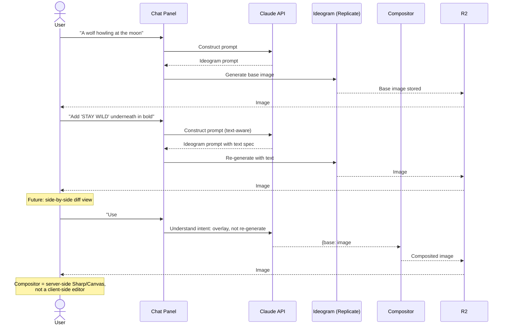

**How this works:**
- Claude determines whether the user's request needs a full re-generation or just a text overlay on an existing image
- A server-side compositor (Sharp or node-canvas) handles text overlay, positioning, and basic transforms
- All generated images are stored so the user can compare versions and go back
- A side-by-side comparison view in the gallery would help with iteration
- A visual editor could replace or supplement the chat-based approach later if needed

### Multi-Placement Design

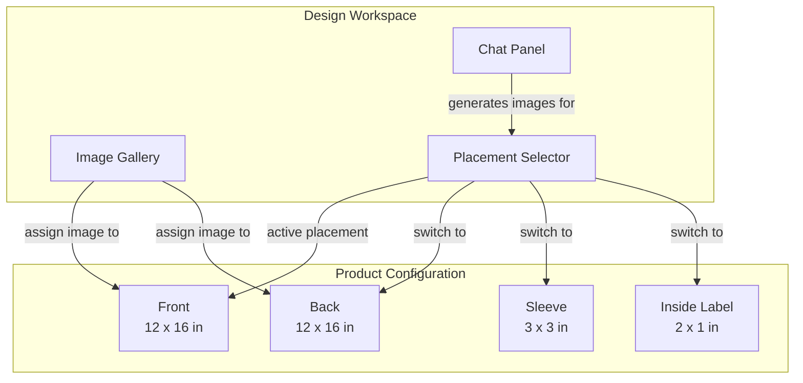

**Data model change**: a design becomes a collection of placements, each with its own image and chat context:

```
design
  ├── placements: [
  │     { position: "front", imageUrl: "...", chatHistory: [...] },
  │     { position: "back",  imageUrl: "...", chatHistory: [...] },
  │     { position: "sleeve", imageUrl: null },
  │     { position: "label",  imageUrl: "...", generated: false }
  │   ]
  ├── currentPlacement: "front"
  └── ...existing fields
```

The chat panel operates in the context of the active placement. Switching placement = switching chat thread. Gallery shows images for all placements.

### Custom Inside Label

A special placement type with a structured template rather than free-form design:

```
┌─────────────────────────┐
│                         │
│     [ PRNTD logo ]      │
│                         │
│   Order #a1b2c3d4       │
│                         │
│   ── Made for ──        │
│   Sarah Johnson         │
│   sarah@email.com       │
│                         │
│   1 of 1                │
│                         │
└─────────────────────────┘
```

**Fields** (all optional except logo):
- PRNTD logo (always present)
- Order number
- Customer name
- Contact info (email or phone, customer's choice)
- Edition number (for limited runs: "3 of 50")

This is not AI-generated — it's a template rendered server-side with the customer's data. The user opts in during checkout ("Add personalized label — free").

**Printful support**: Printful supports inside label printing on many products. The label image is sent as an additional placement in the order API call.

### Unified Mobile Flow

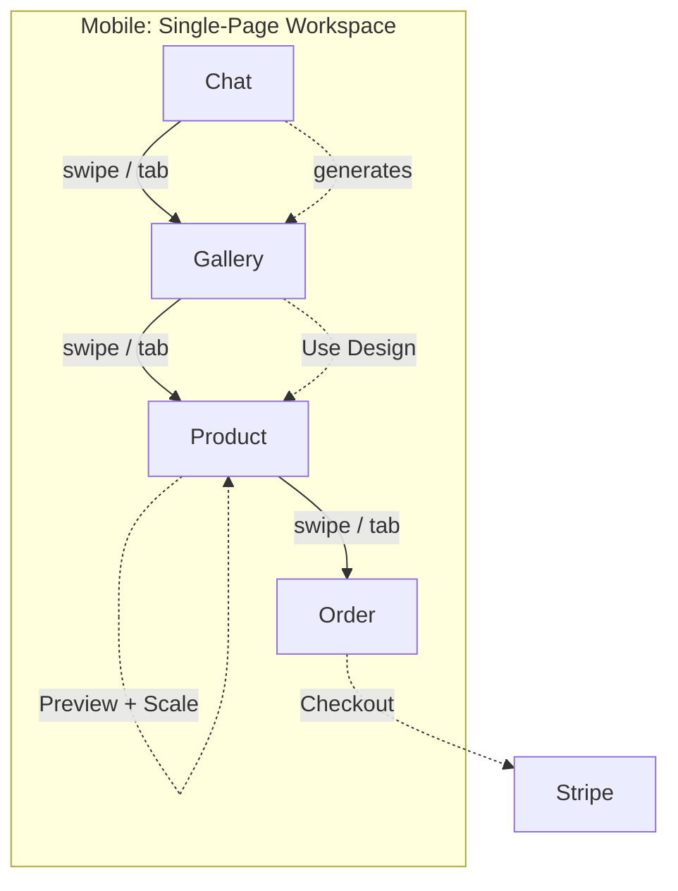

One option for mobile: replace the 4 separate pages with a tabbed or swipeable workspace. Each tab has its own scroll context. Design, preview, and order configuration would happen in one place. Desktop could keep the current layout since the two-column chat+gallery works at wider viewports.

---

## 3. Social & Competition Features

### Design Showcase

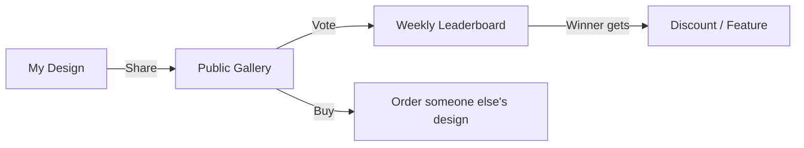

**Concepts:**
- **Public gallery**: users opt-in to share finished designs (after ordering or explicitly)
- **Voting**: simple upvote, time-bounded (weekly/monthly)
- **Competitions**: themed challenges ("Best animal design this week"), winner gets a free shirt or featured placement
- **Buy others' designs**: any public design can be ordered by anyone. Original designer gets credit (and optionally a cut — future)

**Data implications:**
- `design.isPublic: boolean` — opt-in to gallery
- `design.shareSlug: text` — unique URL for sharing (`prntd.org/d/abc123`)
- `design.votes: integer` — vote count (or separate vote table for uniqueness)
- `design.originalDesignerId: text` — when someone orders another's design

**Privacy**: only the finished image is public, never the chat history or prompts.

### Design Sharing & Virality

```
prntd.org/d/abc123
  ├── Shows the design on a shirt mockup
  ├── "Order this design" CTA
  ├── "Create your own" CTA
  ├── Designer attribution (optional, opt-in)
  └── Social meta tags (OG image = mockup)
```

Shareable links with OG images (mockup as the preview) give designs a way to spread on social media. Each link doubles as an acquisition funnel.

---

## 4. Attribution & Ad Tracking

### Promo Code Attribution (Current)

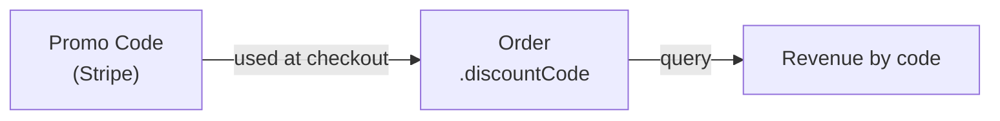

Today: Stripe manages codes, webhook stores `discountCode` on orders. Query `SELECT discountCode, COUNT(*), SUM(totalPrice) FROM order GROUP BY discountCode` for basic attribution.

### Future: Campaign Tracking

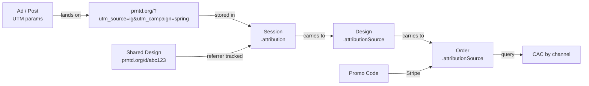

**New fields:**
- `design.attributionSource: text` — captured from UTM params or referrer at design creation time
- `order.attributionSource: text` — inherited from design, or overridden by promo code channel

**Tracking flow:**
1. User lands with UTM params → stored in cookie/session
2. When design is created, attribution source is recorded
3. When order is placed, attribution carries through
4. Admin dashboard: revenue, orders, and CAC by channel

**Promo code integration**: each promo code can be associated with a channel in the future local `promotion` table (Layer 2 from the discount code discussion). This ties Stripe promo redemptions to marketing channels.

---

## 5. Product Expansion & Custom Manufacturing

### Product Lineup Roadmap

```
Current:
  ├── Classic Tee (Bella Canvas 3001) — 13 colors
  ├── Box Tee (Cotton Heritage MC1087) — 5 colors
  └── Clear iPhone Case — 13 models

Near-term:
  ├── Women's Tee (3rd apparel)
  ├── Hoodie
  └── Poster / Art Print

Medium-term:
  ├── Canvas print
  ├── Stickers (die-cut)
  ├── Tote bag
  └── Mug

Longer-term:
  ├── Multi-placement (front + back + sleeve)
  ├── Custom inside labels
  └── All-over print
```

### Multi-Placement Order Flow

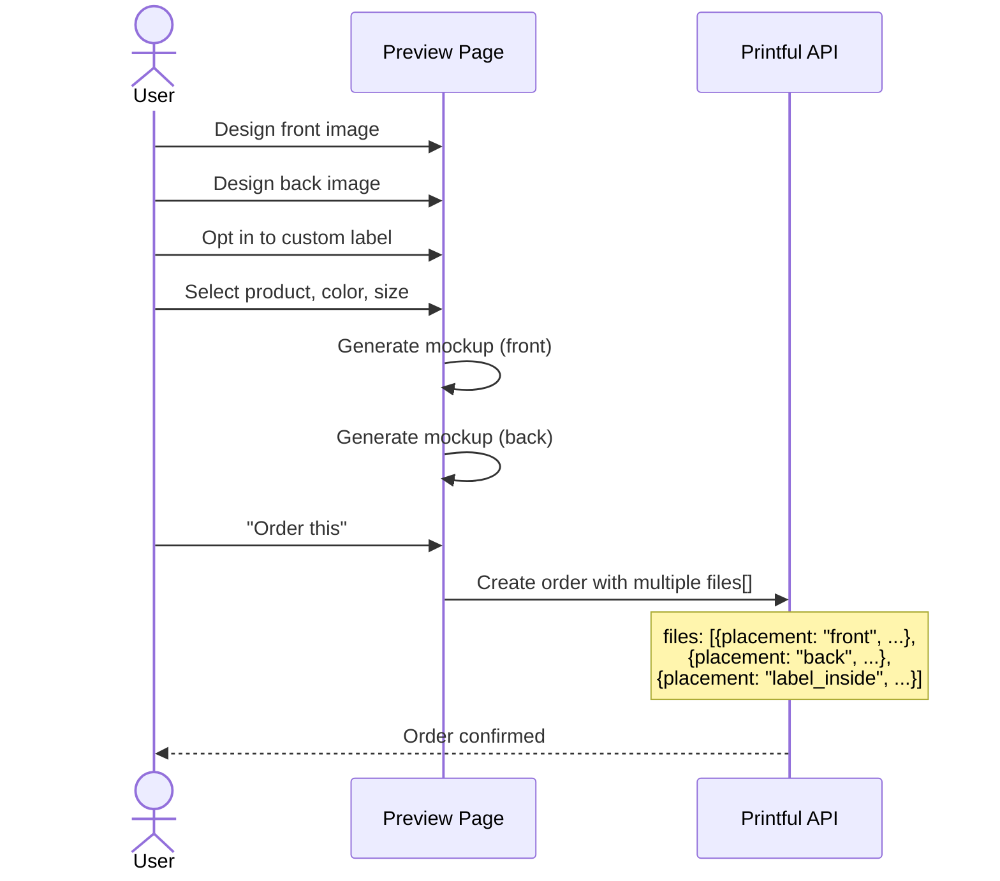

Printful's API accepts multiple `files[]` entries with different `placement` values. The API-side support exists; the remaining work is the UI and data model for managing multiple images per design.

---

## 6. Phased Implementation

### Phase 1: Foundation Cleanup
- Remove quality (standard/premium) selector
- Finish discount code UI (banner, admin display)
- Design persistence (threads accessible after ordering)
- End-to-end promo code testing

### Phase 2: Iteration & Text
- Server-side compositor for text overlay (Sharp/node-canvas)
- Claude understands when to composite vs. re-generate
- Side-by-side image comparison in gallery
- Better mobile flow (tabbed workspace)

### Phase 3: Multi-Placement
- Placement selector in design workspace
- Per-placement chat context
- Multi-file Printful order submission
- Custom inside label template

### Phase 4: Social & Growth
- Public design gallery with shareable links
- Voting / competitions
- "Order someone else's design" flow
- UTM / attribution tracking
- Campaign analytics in admin

### Phase 5: Scale
- Rate limiting / generation caps
- Women's tee, hoodies, posters, stickers
- All-over print
- Edition numbering for limited runs
